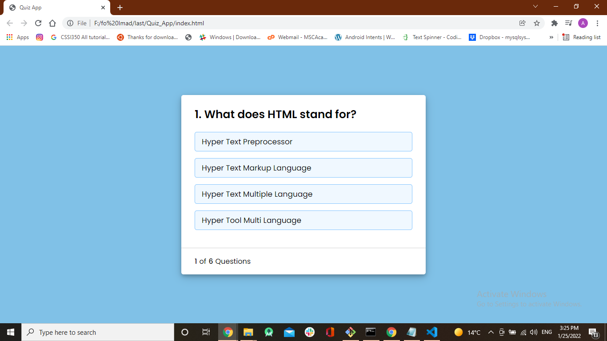

# to do list

> QuizApp is a project where you can answer some questions and practice software development intrviewa 

## you can see the  [live demo](https://alaaalsalem.github.io/Quiz_App/) 
of this project

Additional description about the project and its features.

## Built With

- Javascript
- HTML
- CSS

## Getting Started

To get a local copy up and running follow these simple example steps.

run `git clone https://github.com/AlaaAlsalem/Quiz_App.git` 

## Authors

👤 **Aladdin Alsalem**

- GitHub: [@Aladdin](https://github.com/AlaaAlsalem)
- LinkedIn: [Aladdin Alsalem](https://www.linkedin.com/in/aladdin-alsalem-5a68ba1a0/)
## 🤝 Contributing

Contributions, issues, and feature requests are welcome!

Feel free to check the [issues page](../../issues/).

## Show your support

Give a ⭐️ if you like this project!

## 📝 License

This project is [MIT](./MIT.md) licensed.